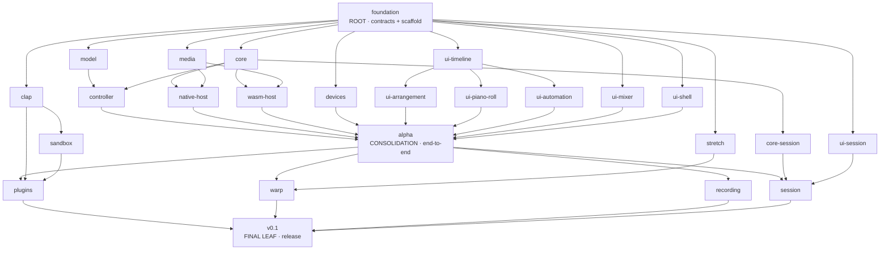

# Ethereal — Build Orchestration Plan

How the v0.1 build is split into PRs built by parallel agents in separate git worktrees, coordinated by one manager agent.
Architecture decisions live in [ARCHITECTURE.md](./ARCHITECTURE.md).

## 1. Principles

1. **Contracts first, then fan out.** The root PR freezes every cross-boundary interface (protocol, model types, core traits, `EngineTransport`, crate/folder skeletons). Everything after it implements instead of negotiating.
2. **One node = one PR = one agent = one owned set of paths.** Ownership is disjoint within a wave and enforced by `just check-ownership`.
3. **Separate crates/folders over shared files.** Anything that two nodes would both edit gets split, pre-created as a stub by the root, or routed through the manager.
4. **Trunk-based.** Every node branches from `main` after all its dependencies are merged. No stacking on unmerged sibling branches (exception: manager-approved, recorded in the decision log). Whenever anything lands on `main`, in-flight nodes merge it in (§6.2).
5. **Mocks unblock UI.** UI nodes build against `MockTransport` + generated types, so they never wait for the engine.
6. **Consolidation nodes** are where parallel work is joined, the mock is replaced with the real thing, and end-to-end tests are added.
7. **Fix the base, don't build on a bad one.** If a foundational decision turns out wrong, the change is made once, in the base, by the manager, and every in-flight node merges it (§6.1). This beats working around it in N branches. Use it when needed, not for things a node can solve locally.

## 2. The graph



Critical path: `foundation → core → controller → alpha → {plugins | warp} → v0.1`. The manager schedules by longest remaining path first.

## 3. Nodes

Size: S ≈ half a day of agent work, M ≈ 1 day, L ≈ 2+ days (relative, used only for scheduling and restructure math).

### Root

| Node | Size | Owns | Deliverable / acceptance |
|---|---|---|---|
| `foundation` | L | everything (it's first) | Cargo workspace with **all** crates listed as members (stubs compile). `[workspace.dependencies]` pre-populated with every anticipated crate. `ether-protocol` complete v0 command/event set + TS generation. `ether-model` types (no logic). `ether-core` public API + traits (`Node`, `Device`, `Engine`, `RenderSnapshot`) with `todo!()` bodies. `Stretcher`, `PluginNode`, `Controller` traits. Tauri + Vite apps boot. React shell with a layout slot per feature, each slot importing a stub component from its feature folder. `ui/src/kit` minimal primitives. `EngineTransport` + `MockTransport` (in-memory model, fake meters/playhead). CI: fmt, clippy, tests, `cargo check --target wasm32-unknown-unknown` for wasm crates, tsc, vitest, lint, **ownership check**, generated-types freshness check, matrix compile check on macOS/Linux/Windows. `.github/ownership.toml`. **Human checkpoint: user reviews contracts before fan-out.** |

### Wave 1: parallel after `foundation`

| Node | Size | Owns | Acceptance |
|---|---|---|---|
| `model` | M | `crates/ether-model/**` | Op application, inverse ops, undo/redo, patch generation, `.ether` round-trip, migration framework, property tests. |
| `core` | L | `crates/ether-core/**` except `src/session/**` | Graph + topo sort, tempo map (ramps), sample-accurate scheduler with block splitting, transport/loop, mixer (vol/pan/sends/buses), PDC, meters, automation evaluation. Tests prove no alloc in `process`. |
| `devices` | S | `crates/ether-devices/**` | Synth (sine/saw/square/tri, ADSR, filter), sampler (one-shot + pitched), compressor, delay. Implements `Device`. Minimal. |
| `media` | M | `crates/ether-media/**` | Decode (WAV/AIFF/FLAC/MP3/OGG), resample, peak mipmaps, all compiling to wasm. |
| `clap` | L | `crates/ether-clap/**`, `crates/ether-plugin-scanner/**` | Scanner process → plugin DB. In-process `PluginNode` via `clack`: process, params, state save/load, floating GUI. Tested against a clack example plugin. |
| `stretch` | S | `crates/ether-stretch/**` | Signalsmith binding behind `Stretcher`, native feature-gated; wasm build compiles with trait only. |
| `ui-timeline` | M | `ui/src/timeline/**` | Time↔pixel (bars/beats/seconds), zoom/scroll store, grid + snapping, selection model, ruler component. |
| `ui-mixer` | M | `ui/src/features/mixer/**`, `ui/src/features/devices/**` | Mixer strips, meters, sends; device chain with generic param UI. |
| `ui-shell` | M | `ui/src/features/{transport-bar,browser,project}/**` | Transport bar, tempo/signature, sample browser over engine-visible locations, project list/new/open/save/rename/duplicate/delete via the engine-side project store (no UI file access; see CONTRACTS.md §2b). |
| `ui-session` | M | `ui/src/features/session/**` | Clip grid, launch/stop buttons, scenes (against mock). |

### Wave 2

| Node | Deps | Size | Owns | Acceptance |
|---|---|---|---|---|
| `controller` | model, core | M | `crates/ether-controller/**` | Commands → ops → model → patches; model → `RenderSnapshot` compiler; device factory registry. Host-agnostic, wasm-safe. |
| `native-host` | core, media | L | `crates/ether-native/**`, `apps/desktop/**`, `ui/src/transport/tauri/**` | cpal RT thread, snapshot swap, GC thread, disk streaming, Tauri commands/channels, `TauriTransport`. |
| `wasm-host` | core, media | L | `crates/ether-wasm/**`, `apps/web/**`, `ui/src/transport/wasm/**` | Controller in a Worker, engine in AudioWorklet, SAB rings, `WasmTransport`, COOP/COEP dev server. |
| `core-session` | core | M | `crates/ether-core/src/session/**` | Clip slots, quantized launch/stop, scenes, follow-legato basics. |
| `sandbox` | clap | L | `crates/ether-sandbox/**` | Out-of-process `PluginNode`: helper binary, shared-memory buffers, semaphore sync, +1 block latency reported to PDC, crash detection → node bypass. |
| `ui-arrangement` | ui-timeline | L | `ui/src/features/arrangement/**` | Tracks, clips (move/resize/split/loop), canvas waveforms from peaks. |
| `ui-piano-roll` | ui-timeline | M | `ui/src/features/piano-roll/**` | Note edit, velocity lane, quantize. |
| `ui-automation` | ui-timeline | M | `ui/src/features/automation/**` | SVG breakpoint lanes, curve types. |

### Consolidation: `alpha`

Deps: controller, native-host, wasm-host, devices, ui-arrangement, ui-piano-roll, ui-automation, ui-mixer, ui-shell. Size L. Owns: wiring anywhere, but only to connect. Refactors go through the manager.

Acceptance: real transports replace the mock in both builds. You can open an `.ether` file, play a MIDI clip through the synth and an audio clip with automation through the mixer + compressor/delay, edit, undo, save, and reload. Playwright E2E on the web build and a native smoke test. **Human checkpoint: the user listens.**

### Wave 3: parallel after `alpha`

These nodes touch several layers. To stay conflict-light, `alpha` pre-creates per-feature module files and hook points (`ether-model/src/{warp,recording,plugins,session}.rs`, `ether-core/src/{warp,recording}/`, `ui/src/features/{warp,recording,plugins}/`). Each node owns its module files, plus one-line registrations in shared files.

| Node | Deps | Size | Acceptance |
|---|---|---|---|
| `plugins` | alpha, clap, sandbox | M | Plugin browser, insert on device chain, per-plugin sandbox toggle, state in `.ether`, PDC verified. |
| `warp` | alpha, stretch | L | Warp markers in model/core/UI, BPM detection stub, stretched playback native. Web: unwarped fallback. |
| `recording` | alpha | M | Arm, input monitoring, audio + MIDI record, latency-compensated placement, `midir`. |
| `session` | alpha, core-session, ui-session | M | Session view live on real engine, clip launching quantized, session→arrangement recording optional/deferred. |

### Final leaf: `v0.1`

Deps: plugins, warp, recording, session. Full E2E suite, `assert_no_alloc` soak test, cross-platform CI compile green, README/user docs, tag release.

## 4. Conflict hotspots and how they're neutralized

| Hotspot | Mitigation |
|---|---|
| Workspace `Cargo.toml` members | Root lists all crates up front; nobody else edits members. |
| New Rust deps | Root pre-populates `[workspace.dependencies]`; crates add `dep.workspace = true` in their **own** `Cargo.toml`. A dep missing from the workspace goes through a BCR (§6). |
| `Cargo.lock`, `pnpm-lock.yaml` | Never hand-merged: when syncing with `main`, take `main`'s version and regenerate. |
| Generated TS types | Committed, regenerated when syncing with `main`; the local gate checks freshness. |
| Protocol enums | Split per domain file (`transport.rs`, `tracks.rs`, `clips.rs`, `devices.rs`, `session.rs`, `plugins.rs`, …). Changes only via BCR. |
| App shell / feature registration | Root creates a slot per feature with a stub import; features only edit their own folder. |
| `ui/package.json` | Root pre-installs anticipated deps; additions via BCR. |

**Ownership enforcement:** [`.github/ownership.toml`](../.github/ownership.toml) (in the repo, versioned with the code) maps node id → globs; `scripts/check-ownership.py` enforces it (`just check-ownership` locally). CI derives the node from the branch name (`node/<id>`) and fails if the diff touches files outside its globs (lockfiles/generated files whitelisted). Consolidation nodes have wide globs.

## 5. Runtime topology

- **Manager** = a long-lived Claude Code session (the main session) running `/loop`. It owns the graph, merges, restructuring and the status artifact. It does not write product code.
- **Workers** = background agents launched with `isolation: "worktree"`, one per ready node, branch `node/<id>`. Default concurrency cap: **6**, adjustable.
- **Reviewer** = a short-lived agent per PR, spawned by the manager before merge. It checks acceptance criteria, contract adherence and RT-safety rules.
- **GitHub** = the system of record for code (draft PR opened early). **GitHub Actions CI is disabled for cost**: the gate is local (§7).
- **`.orchestra/`** = the coordination bus. It lives in the main checkout (absolute path, gitignored), so all worktrees share it.

The manager is a judgment-driven loop rather than a fixed workflow script, because the graph must be restructured at runtime.

## 6. Communication protocol

```
.orchestra/
  graph.json                  canonical DAG (manager-owned)
  (ownership lives in the repo: .github/ownership.toml)
  nodes/<id>/status.json      worker-owned: state, progress %, summary, last_heartbeat, blockers
  inbox/manager/<ts>-<id>-<kind>.json   worker → manager
  inbox/<id>/<ts>-<kind>.json           manager → worker
  decisions.jsonl             manager's restructure / merge log
```

**Worker → manager kinds:** `bcr` (base change request, §6.1: a change to contracts or a foundational decision, with rationale and a proposed diff), `blocked` (on what), `question`, `discovery` (scope much bigger or smaller than planned, duplicated work, a better split), `ready-for-review`.

**Manager → worker kinds:** `directive` (scope change), `sync` (something landed on `main`; merge it in, §6.2), `pause`, `cancel`, `restructure` (new node definition).

**Worker obligations:**
- Update `status.json` at every commit or at least every ~20 minutes of work.
- Check its inbox at every commit.
- Open a draft PR after the first meaningful commit.
- Never edit outside owned paths. If it needs to, it sends a `bcr`.
- Always use the `just` dev commands (`just dev-ui`, `just dev-web`, `just dev-desktop`, `just test-all`, ...). Never hardcode ports, app data paths or IPC names: they derive from `ETHER_INSTANCE` so parallel worktrees don't clash (README "Running multiple dev instances"). Use `ETHER_AUDIO=null` when no sound is needed.
- On finishing, mark the PR ready and send `ready-for-review`.

The manager also uses `SendMessage` to wake or redirect an agent whose turn has ended, and gets automatic notifications when agents complete.

### 6.1 Base Change Requests (BCR)

Used when a node needs a change outside its owned paths that affects the shared base: contracts, protocol, shared deps, skeletons, or a foundational design decision that looks wrong. Only when it's necessary. Anything solvable inside the node's own paths stays there.

1. The worker sends a `bcr` with the problem, the proposed change and who it thinks is affected. It keeps working on unaffected parts. If fully blocked, it marks itself `blocked`.
2. The manager triages it:
   - *Trivial and additive* (new variant, field with a default, new workspace dep): accept directly and batch it with other pending BCRs.
   - *Non-trivial or breaking*: the manager **consults the affected in-flight workers** via their inbox or `SendMessage` ("BCR-7 proposes X; impact on your node? objections? better alternative?"). It waits at most one tick for answers, then decides. The cost model (§8) applies when in-flight work would be invalidated.
3. The manager implements the change itself in a short-lived `base/<n>` branch/PR. It's usually small and touches only base files. It merges that PR once the local gate passes. Human approval is only needed if it changes a decision in ARCHITECTURE.md, and then ARCHITECTURE.md is updated in the same PR.
4. The manager sends `sync` to all in-flight nodes, with a note on what changed and what they must adapt.

A foundational fix landed early is always preferred over N nodes building on a wrong assumption. The manager may also start a BCR itself when it notices a pattern across nodes, for example two workers asking the same question.

### 6.2 Reacting to `main`

`main` moves whenever a node, `base/<n>` or consolidation PR is merged. On `sync`, every in-flight worker must:

1. Merge `origin/main` into its branch. Use merge rather than rebase, so there's no force-push; the final PR is squash-merged anyway.
2. Regenerate lockfiles and generated types instead of hand-merging them.
3. Adapt its code to the change, get the local checks green again, and note the sync in `status.json`.

Timing depends on what landed. If the `sync` is marked `urgent` (a BCR touching the node's contracts), the worker syncs immediately. Otherwise it syncs at its next commit. Workers also check `main` themselves before marking a PR ready.

## 7. Node lifecycle and merge policy

`queued → ready (deps merged) → running → blocked → in-review → changes-requested → merged` (also `cancelled`, `superseded`)

Merge gate:
- **Local gate green, run by the worker and re-run by the manager** on the branch merged with current `main`: `just check-all`, `just test-all`, `just check-ownership`, and `just gen-types` producing no diff. GitHub Actions CI is disabled for cost (`.github/workflows/ci.yml` is kept; re-enable with `gh workflow enable ci.yml`).
- ownership check passes
- **reviewer agent approves**: a read-only agent checks each acceptance criterion from the node's brief (MET / PARTIAL / MISSING, with evidence), contract adherence, real-time rules and leftover stubs. CHANGES_REQUESTED goes back to the worker. It is skipped only for the manager's own small `base-<n>` PRs.
- up to date with current `main` (merged in, conflicts resolved)
- squash-merged by the manager

Human approval is required at **`foundation`**, **`alpha`** and **`v0.1`**. Everything else auto-merges unless the user flips `require_human_approval` for a node. When several PRs are ready at once, the manager merges the smallest diff first to minimize sync churn.

## 8. Restructuring policy

**Triggers:**
- A node is blocked for more than one manager tick with no path forward.
- A breaking BCR.
- A node's estimated size grows more than 2× (from `discovery`).
- The same check failure repeats 3 times.
- Two nodes are discovered to be building the same thing.
- A dependency turns out to be unnecessary, which lets work start earlier.

**Possible actions:** split a node, merge nodes, add or remove edges, insert a `base-<n>` or consolidation node, pause or reorder, cancel and restart with a new definition.

**Cost model** (in S/M/L units; sunk work is ignored, only future cost counts):

```
cost_keep       = remaining work on current plan + expected rework it causes downstream
cost_restructure = new plan's remaining work
                 + discarded in-flight work that must be redone
                 + sync/merge churn for affected in-flight nodes
                 + context-restart overhead (≈ S/4 per restarted agent)
restructure iff  cost_keep − cost_restructure > 0.25 × cost_keep   (hysteresis against thrash)
```

Every evaluation, whether it acts or not, is appended to `decisions.jsonl` and shown in the status artifact with the numbers. Restructures that change human-checkpoint nodes or cancel more than one L node's worth of in-flight work need user confirmation.

## 9. Status artifact

A private claude.ai artifact using the shared **artifact database**. The manager writes rows with `ArtifactData`, so updates never require republishing the page. The page refreshes its data periodically; a small delay is fine.

**Collections:**
- `nodes`: id, title, wave, deps, size, owned paths, state, agent id, worktree, branch, PR number/url, CI state, progress, summary, blocker, last heartbeat, started/merged times.
- `events`: timestamped log.
- `decisions`: restructure evaluations with cost numbers.
- `bcrs`: id, from, summary, consulted nodes, decision, state, merged PR.

**Page contents:**
- The DAG, with nodes colored by state and the critical path highlighted. It re-lays out automatically when the graph is restructured.
- Per-node detail on click: PR link, CI, agent, last heartbeat, blocker.
- Headline metrics: merged/total, running, blocked, ETA along the critical path.
- The event feed and decision log.
- Staleness warning when a running node's heartbeat is older than 30 minutes.

## 10. Manager loop (each tick ≈ 10 min, plus on every agent notification)

1. Read `inbox/manager/*`, all `status.json` files, `gh pr list --json` and PR checks.
2. Process BCRs per §6.1 (consult, decide, land on `main`).
3. Review and merge PRs that pass the gate (§7). Mark dependents ready, and send `sync` to **every** in-flight node (§6.2).
4. Evaluate restructure triggers (§8).
5. Launch ready nodes up to the concurrency cap, longest remaining path first.
6. Detect stale workers (no heartbeat for 30 minutes): ping them via `SendMessage`, and relaunch if there's no response.
7. Push all changes to the artifact DB.

## 11. Worker prompt template

```
You are the worker for node `<id>` of the Ethereal build.
Read docs/ARCHITECTURE.md and docs/ORCHESTRATION.md (§4, §6, §7) first.
Branch: node/<id> (already created from main @ <sha>). Worktree: <path>.
Owned paths: <globs>. Do not edit anything else — send a `bcr` instead. If you believe a foundational decision is wrong, say so early via `bcr`; don't build around it.
Deps merged: <list + one-line summary of what each provides>.
Deliverable: <acceptance criteria from §3>.
Coordination dir: <abs path>/.orchestra — update nodes/<id>/status.json and check inbox/<id>/ at every commit.
Open a draft PR (`gh pr create --draft`) after the first meaningful commit.
Done = acceptance met, CI green, tests added, PR marked ready, `ready-for-review` sent.
```

## 12. Prerequisites before `foundation`

- A GitHub repository with this repo as remote (none exists yet). Branch protection on `main` requires CI.
- GitHub Actions runners: macOS (primary), plus Linux and Windows for compile checks.
- Local toolchain: Rust stable + `wasm32-unknown-unknown`, `wasm-bindgen-cli`, Node + pnpm, Tauri CLI, C++ toolchain (Signalsmith). The `foundation` node verifies these and documents them.
